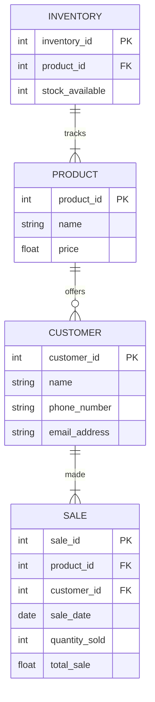

## Description of entities and relationships, and how they support business operations. 
> _Base on the instructions, these are the relationships Mapped out: products to sales, customers to sales, and products to inventory._
> 
**PRODUCT**
> Product's attributes are name, price and product_id which is the primary key (PK).
PRODUCT and SALE have a one-to-many relationship because a specific product could be sold more than one time. Also, a company could sale the same product many times.
> 
**CUSTOMER**
> Each customer has specific attributes: customer_id, name, phone_number, and email_address. Customer_id is the primary key in this item.
here we have a one-to-many relationship because a customer can make many sales to happen.
> 
**SALE**
> The item SALE contains sale_id defined as a primary key (PK), product_id defined as a foreign key (FK), customer_id also defined as a foreign key (FK).
In fact, the attributes sale_date, quantity_sold and total_sale are design to track the business sales over time.
For a sale to occur, we need to have a product, raison why product_id is a foreign key (FK) in the SALE item.
As it is stated above, PRODUCT and SALE have a one-to-many relationship. However, we could not ignore that a sale also need a customer who places an order. 
>
**INVENTORY**
>
> The item INVENTORY has inventory_id as primary key (PK) and product_id as foreign key (FK). This foreign key establish a link betweem the items INVENTORY and PRODUCT.
This link helps the retail company to keep track of the quantity of products they still have in stock. Without any existing product, there will be no need to do an inventory.
There is a one-to-many relationship between PRODUCT and INVENTORY.
